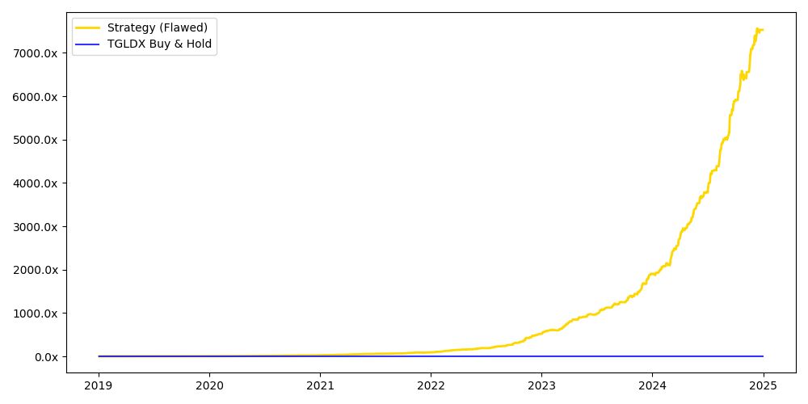
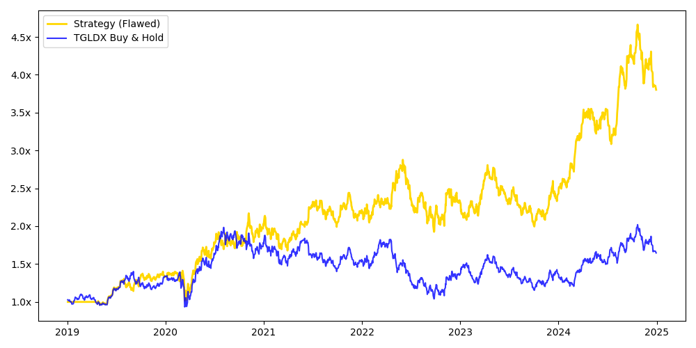

# Computational Mathematics Projects

Collection of computational experiments exploring numerical methods, probabilistic techniques, and mathematical structure through simulation and visualization.

## Projects

### 1. Prime Distribution

**What it Does:**  
Analyzes how prime numbers are distributed by counting primes in fixed intervals and comparing observed behavior with theoretical expectations.

**Core Idea:**  
Empirical exploration of the Prime Number Theorem through interval-based analysis.

**Approach:**  
	•	Partition integers into intervals of size 100 up to 10⁶  
	•	Count primes within each interval  
	•	Compute expected density using 100/ln(n)  
	•	Measure local deviation from the theoretical estimate  

**How it Works:**  
Prime counts are computed across uniform intervals, producing a distribution of observed densities. These are compared against the asymptotic estimate given by the Prime Number Theorem. The deviation between observed and expected values highlights fluctuations in prime density at finite scales.

**Features:**  
	•	Interval-based prime counting  
	•	Frequency distribution visualization  
	•	Local deviation analysis from theoretical expectation  

**Stack:** Wolfram Mathematica

### 2. Monte Carlo π Estimation

**What it Does:**  
Approximates the value of π using random sampling and visualizes convergence over time.

**Core Idea:**  
Geometric probability via Monte Carlo simulation.

**Approach:**  
	•	Uniformly sample points in a square  
	•	Classify points using the condition x² + y² ≤ 1  
	•	Estimate π from the ratio of points inside the quarter circle  

**How it Works:**  
Random points are generated within a bounded square. Points that fall inside the unit quarter circle are counted, and the ratio of inside to total points is used to approximate π. As the number of samples increases, the estimate converges toward the true value.

**Features:**  
	•	Stochastic sampling-based approximation  
	•	Real-time convergence visualization  
	•	Geometric interpretation of probability  

**Stack:** Python, Matplotlib

# Quantitative Finance Experiments
Collection of experiments exploring trading strategies, backtesting pitfalls, and the gap between theoretical performance and real-world execution. These experiments are designed to expose limitations in naive backtesting and highlight the importance of execution realism.

## Projects

### 1. Gold Lookahead Strategy

**What it Does:**  
Backtests a signal-based trading strategy on gold ETFs and demonstrates how improper data handling can produce unrealistically high returns.

**Core Idea:**  
Impact of lookahead bias on backtesting results.

**Approach:**  
	•	Generate trading signals based on price data  
	•	Execute trades using the same day’s price (biased setup)  
	•	Compare with a corrected implementation using only available information  

**How it Works:**  
In the initial model, the strategy uses the current day’s price to generate and execute trades, introducing lookahead bias. This allows the model to act on information that would not have been available in real time. When corrected to execute trades using only prior data, performance drops sharply, revealing the illusion.

**Results:**  
	•	Biased strategy: 344.5% CAGR  
	•	Buy & hold (TGLDX): 8.7% CAGR  
	•	Corrected strategy: Underperforms buy & hold  

**Key Insight:**  
Small violations of causality in backtesting can completely invalidate results.

**Stack:** Python, NumPy, yfinance, Matplotlib, Pandas

### 2. Gold Mean-Reversion Strategy

**What it Does:**  
Tests a mean-reversion strategy on the price ratio of gold ETFs and evaluates its practical limitations.

**Core Idea:**  
Limits of mean-reversion assumptions in financial markets.

**Approach:**  
	•	Compute the GLD/TGLDX price ratio  
	•	Calculate a 60-day rolling z-score  
	•	Enter positions when the ratio deviates significantly from its mean  
	•	Exit when the ratio normalizes  

**How it Works:**  
The strategy assumes that deviations in the price ratio will revert to the mean. However, the ratio exhibits long periods of divergence, violating this assumption. Additionally, implementing the strategy would require shorting TGLDX, which is not practically feasible.

**Results:**  
	•	Strategy: 25.0% CAGR  
	•	Buy & hold (TGLDX): 8.7% CAGR  

**Key Insight:**  
A strategy can appear statistically valid while being structurally or operationally infeasible.

**Stack:** Python, NumPy, yfinance, Matplotlib, Pandas

